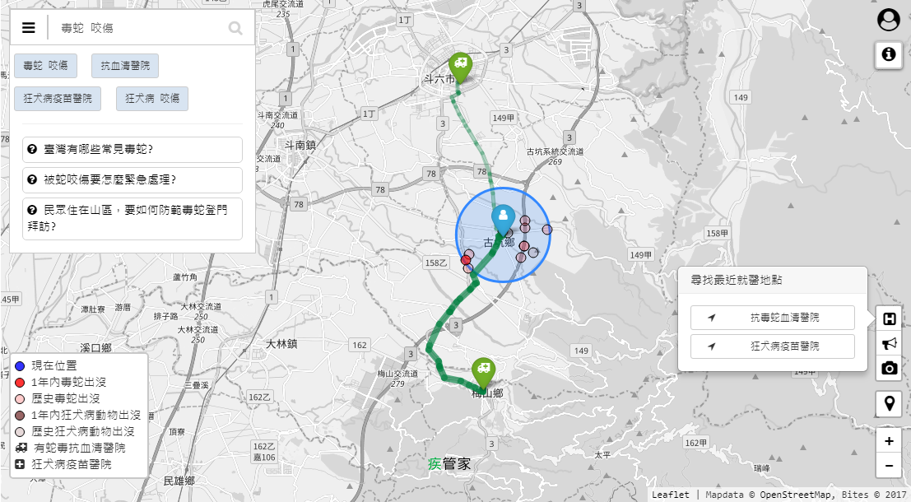
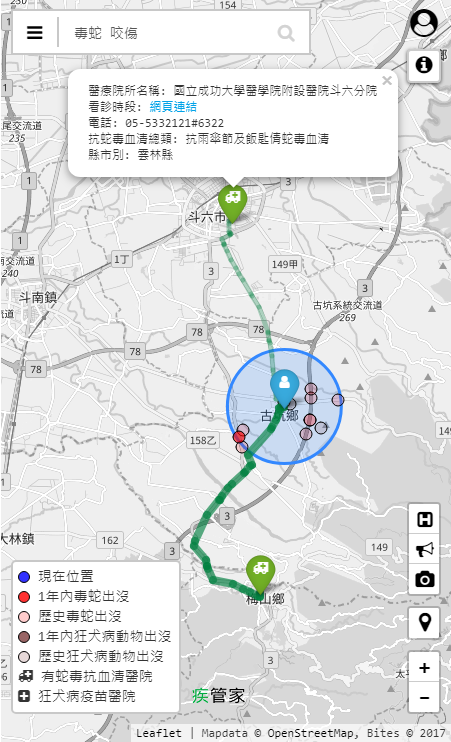

# bites

[](https://travis-ci.org/jiankaiwang/bites)

Bites project is the open source for GIS with AI image recognition for providing residents with information of snake and rabies-infected animals. 


## View


### Desktop View




### Mobile View




## Start the service.

### Clone the Reposiroty

```shell
cd ~
git clone https://github.com/jiankaiwang/bites.git
cd ./bites
```


### Deployment

```shell
npm install --save
sudo npm start
```

